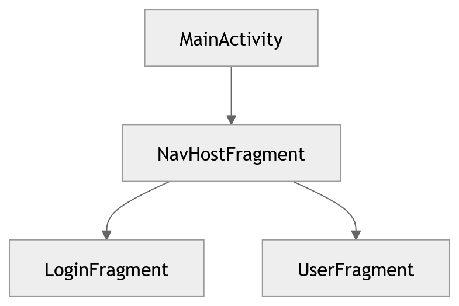
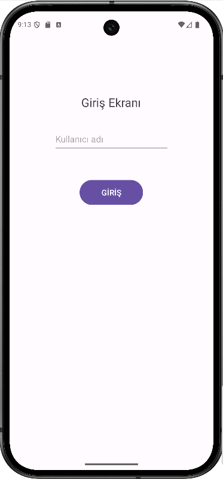
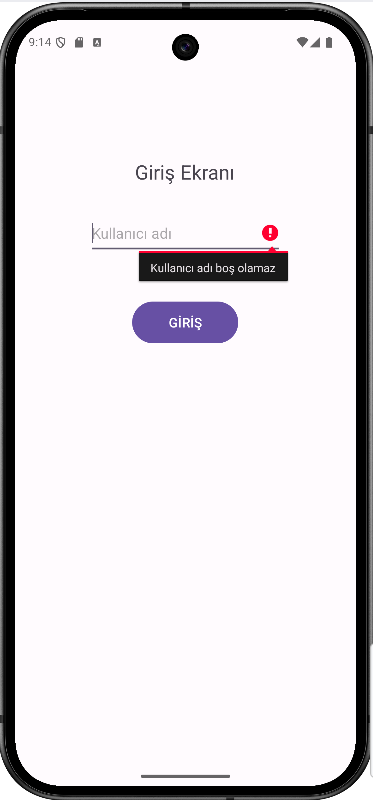
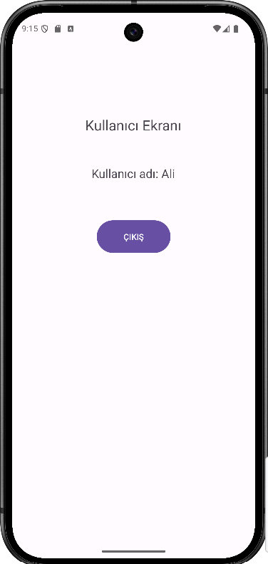
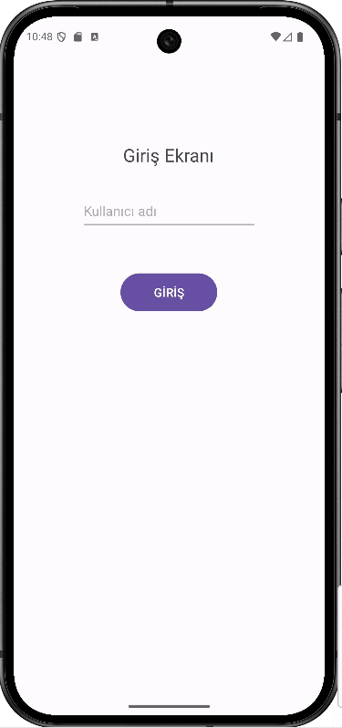

 

 
 Android'de <b>Fragment</b> ve <b>Navigation Component</b> kullanımını öğretmek için hazırlanmış basit ve öğretici bir örnek proje. 
 

## 📖 Proje Hakkında

FragmentAndNav101, Android uygulamalarında kullanılan Fragment yapısını ve Navigation Component’i öğrenmek için hazırlanmış örnek bir projedir.

Bu proje özellikle şu kişiler için uygundur:

1. Android öğrenmeye yeni başlayanlar

2. Fragment mantığını anlamak isteyen geliştiriciler

3. Navigation Component kullanmayı öğrenmek isteyenler

## ✨ Temel Özellikler

    ✅ Navigation Graph: Uygulama akışının görselleştirilmesi ve tek merkezden yönetimi.

    ✅ Safe Args: Sayfalar arası güvenli veri transferi.

    ✅ Fragment Lifecycle: Fragment yaşam döngüsüne uygun yönetim.

    ✅ Backstack Yönetimi: Geri tuşu davranışının özelleştirilmesi.
    
## 🧱 Uygulama Mimarisi

Projede Single Activity Architecture kullanılmıştır.

| Bileşen         | Açıklama                               |
| --------------- | -------------------------------------- |
| MainActivity    | Uygulamanın tek activity’si            |
| NavHostFragment | Fragment geçişlerini yöneten container |
| LoginFragment   | Kullanıcı giriş ekranı                 |
| UserFragment    | Kullanıcı bilgileri ekranı             |

## 🧭 Navigation Akışı

Kullanıcı giriş yaptıktan sonra User ekranına yönlendirilir.

## 📱 Uygulama Görselleri
|Login Screen |Login Error| User Screen |
|:---:|:---:|:---:|
||  ||

## 🎬 Uygulama Demo

  

**Geliştirici:** [Bilişim EML](https://github.com/bilisimeml)  [Akif KORKMAZ](https://github.com/akifkorkmaz)

**Yıl:** 2026

